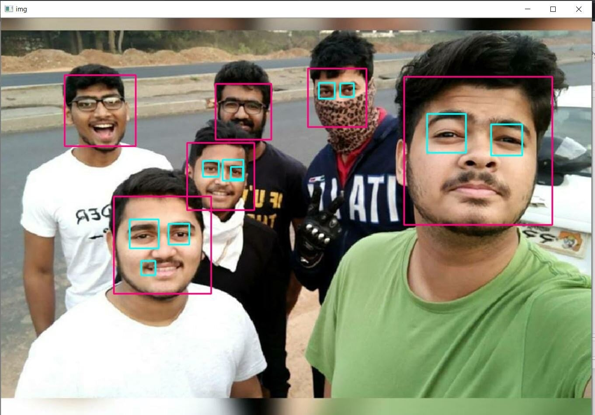

# OpenCV-Implementaion

### Tried to Implement the OpenCV, for detection of Face and Eyes from an image, given as an input, as well as rendering live webcam, using Haar-cascades, for Face and Eyes detection, it was fun working with OpenCV, implementing new things.

### Worked on the Car detection model, using OpenCV, using Haar-cascades, which can be shown as,

### Recently, Explored and learned about Background subtraction, using OpenCV, which is a widely used approach for detecting moving objects in videos from static cameras(CCTV). This deals with an approach of detecting the moving objects from the difference between the current frame and a reference frame(Background).
### Implementation:

